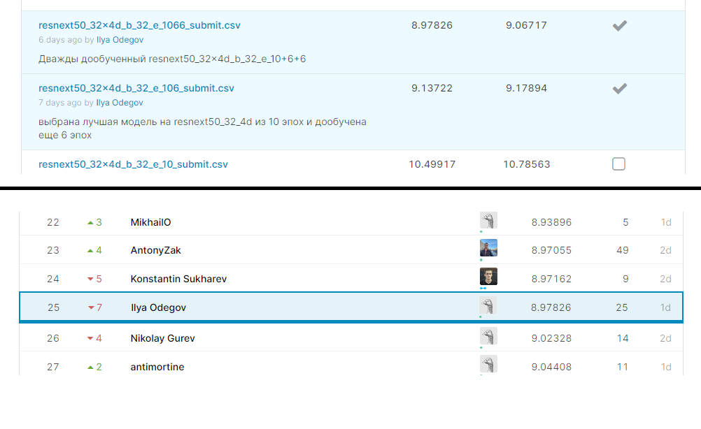

# MADE CV CONTEST 1
Описание решения, которое получило лучший *score* на *kaggle*.

Обучение проводилось локально. В качестве рабочей машины использовался:
  * *Acer Nitro 5 Intel i5-9300H 2.40GHz 8GB Ram NVIDIA GeForce GTX 1650 4GB*.

Во время проведения контеста проведен поиск подходящей архитектуры. Проверены основные модели, которые были взяты из torchvision. Использовал:
  1. *alexnet* (score: 21);
  2. *resnet18/34/50* (получены результаты: score 13-17);
  3. *dencenet121/161* (score: 11-12);
  4. *resnext50_32_4d* (получен лучший score).

После выбора лучшей архитектуры перешел к поиску оптимальных параметров рутины обучения (выбор оптимизатора, *lr_scheduler*, параметров "головы", предсказывающей расположение точек). В качестве оптимизатора были проверены:

 1. *Adam()*;
 2. *AdamW()*;

В качестве основного оптимизатора был выбран *AdamW()*, с параметром *weight_declay*=0.05.

*cmd:*
*python hack_train.py -b 32 -e 10 -lr 3e-4 -d "" -n "resnext50_32x4d_b_32_e_10" --gpu*
*cmd* для первого дообучения:
*python hack_train.py -b 32 -e 6 -lr 3e-5 -d "" -n "resnext50_32x4d_b_32_e_10+6" --gpu -pm "resnext50_32x4d_b_32_e_10_best.pth"*
*cmd* для второго дообучения:
*python hack_train.py -b 32 -e 6 -lr 3e-5 -d "" -n "resnext50_32x4d_b_32_e_10+6+6" --gpu -pm "resnext50_32x4d_b_32_e_10+6_best.pth"*

#ИД, должны лежать в папке с файлами python.#

Луший *score* и *leaderboad*:

